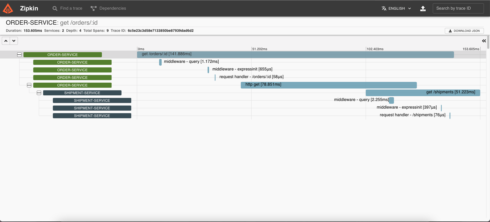

# Basic example

## Prerequiste
- Docker
- Docker-compose
  
## Getting started

### Running project

The repository has already supported Docker to run everywhere. You can start up the repository by the following command

```bash
docker-compose up
```

then wait a sec to pull the images

### Testing

1. Step 1: Run the following comand to make a call to `order-service`
```bash
curl -X GET http://localhost:3001/orders/1
```
2. Step 2: Go to the Zipkin dashboard at http://localhost:9411/zipkin, then query to visualize your trace

